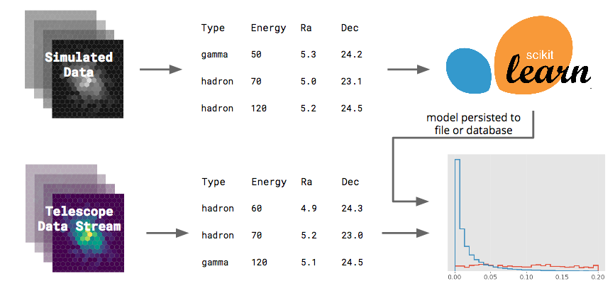

# jayct [](https://travis-ci.org/mackaiver/jayct)

Java library for getting feature representations from images recorded by Imaging Atmospheric Cherenkov Telescopes.

[](https://github.com/mackaiver/jayct)

## Usage 

We tried to keep it simple. Heres an example of how to reconstruct event directions.

```
        ImageReader events = ImageReader.fromURL(url);

        for (ImageReader.Event event : events) {
            List<ShowerImage> showerImages = TailCut.onImagesInEvent(event);
            List<Moments> moments = HillasParametrization.fromShowerImages(showerImages);

            ReconstrucedEvent reconstrucedEvent = DirectionReconstruction.fromMoments(moments, event.mc.alt, event.mc.az);

            if (reconstrucedEvent.direction.isNaN()){
                continue;
            }

            assertTrue(reconstrucedEvent.direction.getZ() > 0);
        }
```

## Execution on Apache Flink

There are two ways to distribute the calculations

 1. Naively one can process each event in parallel using independent pipelines.
  
 2. Each image within an event can be handled in parallel and then merged back into on 
 single data stream using a timed window operation.
 
both approaches are implemented within the `jayct.flink `package.

## Input (subject to change)

Images recorded by the Cherenkov Telescope Array (CTA) are
collected within events. Each event has an ID and some Monte Carlo Information 
associated with it. For now we store the images in JSON files having 
a similar structure as the event containers in [ctapipe](https://github.com/cta-observatory/ctapipe/)
(their structure has changed since this program was written)
  
